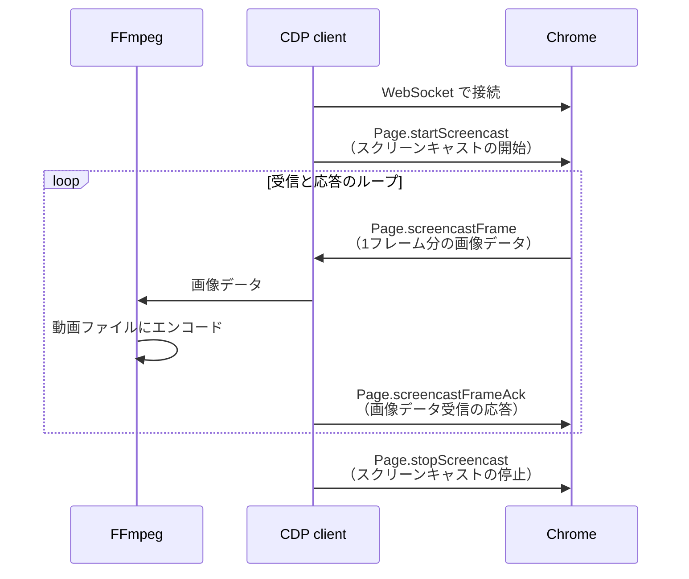

## はじめに

Node.js の E2E テストフレームワークである [Playwright](https://playwright.dev/) には[ブラウザ操作を録画する機能](https://playwright.dev/docs/videos#record-video)があり、その機能には [Chrome DevTools Protocol](https://chromedevtools.github.io/devtools-protocol/)（CDP）が活用されています。

一方、Ruby で実装されたブラウザ操作ツールである [Ferrum](https://github.com/rubycdp/ferrum) も同じく CDP を使用しているものの、調べた限りでは Ferrum にはまだ録画機能が実装されていないようです。

そこで今回、Playwright を参考にして、Ruby でブラウザ録画機能を実装してみました。

## 録画例

## 使用している主な技術

### CDP を用いたスクリーンキャスト

CDP（Chrome DevTools Protocol）は、Chromium ベースのブラウザを操作するためのプロトコルです。今回は扱うブラウザを Chrome に絞って説明します。

CDP を使用して、Chrome のフレーム（アニメーションの1フレーム分のスクリーンショット）を連続的に撮影し、エンドポイント（クライアント）へ送信します。
具体的には、CDP のメソッド・イベントを次の順で実行します：

1. [Page.startScreencast](https://chromedevtools.github.io/devtools-protocol/tot/Page/#method-startScreencast): スクリーンキャスト（フレームの連続撮影と送信）を開始します。オプションとして、画像形式（jpeg または png）、画像品質（0..100）、最大サイズ、および送信頻度（フレームを何枚おきに送信するか）を設定できます。
2. [Page.screencastFrame](https://chromedevtools.github.io/devtools-protocol/tot/Page/#event-screencastFrame): Base64 でエンコードされたフレーム画像、フレーム取得日時などを保持するイベントです。エンドポイント（クライアント）に送信されます。
3. [Page.screencastFrameAck](https://chromedevtools.github.io/devtools-protocol/tot/Page/#method-screencastFrameAck): 受信側が「`Page.screencastFrame` イベントを正常に受け取った」という応答です。この応答が来た後、Chrome は次の `Page.screencastFrame` イベントを発火します。スクリーンキャストを停止するまで、2と3が繰り返されます。

最後に、適当なタイミングで [Page.stopScreencast](https://chromedevtools.github.io/devtools-protocol/tot/Page/#method-stopScreencast) でスクリーンキャストを停止します。

### FFmpeg を用いた画像から動画への変換

[FFmpeg](https://ffmpeg.org/) は、主に動画や音声の変換に使用されるソフトウェアです。

FFmpeg を使用して、連続するフレーム画像を動画として逐次的に追加していくことで、1つの連続した動画ファイルを生成します。具体的には、`-f image2pipe` オプションを使い、パイプを通じて受け取った連続する画像データを動画ファイルとして出力します。

その他の細かなオプション、たとえば解像度やフレームレートなどは、[Playwright の設定](https://github.com/microsoft/playwright/blob/release-1.44/packages/playwright-core/src/server/chromium/videoRecorder.ts#L101)を参考にしています。

## シーケンス図

Chrome と CDP クライアント（CDP を介して Chrome と通信するクライアント）、FFmpeg のやり取りをシーケンス図で表すと、次のようになります。



## 実装した Ruby スクリプト

### 実行環境

- Ruby 3.3.0
- gem の chrome_remote^[`chrome_remote` はすでにメンテナンスされておらず、README に「代わりに Ferrum を使うとよい」という記載があります。しかし今回は、Ferrum は `Page.startScreencast` のサポートがないこと、他に試した gem `websocket-client-simple` は画像データ送受信のタイムラグが発生してしまうことを踏まえて、`chrome_remote` を使うこととしました] 0.3.0
- FFmpeg 7.0
- Google Chrome 124.0.6367.79 (arm64)


Playwright の [`playwright-core/src/server/chromium/videoRecorder.ts`](https://github.com/microsoft/playwright/blob/release-1.44/packages/playwright-core/src/server/chromium/videoRecorder.ts) を参考にしつつ、次のように実装しました。

@[gist](https://gist.github.com/AudioStakes/50ed995cc2190b5facaadb92054e4507)

### 使い方

事前準備として、Google Chrome を `remote-debugging-port` を有効にした状態で起動しておく必要があります。
port 番号はデフォルトの 9222 です。
macOS の場合は以下のコマンドで起動できます。

```
$ /Applications/Google\ Chrome.app/Contents/MacOS/Google\ Chrome --remote-debugging-port=9222
```

Chrome を起動した後、スクリプトを実行します。

```
$ ruby chrome_screen_recorder.rb
Connecting to Chrome launched with --remote-debugging-port=9222 ... Connected.
Recording started. Press Ctrl+C to stop.
```

スクリプトの実行中は Chrome が録画され続けます。
Ctrl+C を押すと録画が終了され、動画が WebM 形式でローカルに保存されます。WebM はブラウザで再生できます。

### 注意点

`Page.screencastFrame` イベントの処理がフレームレート（25 fps）を下回る場合、実際の録画時間より短い動画が生成されてしまいます。この問題を解決するため、次のように、遅延した場合は最後に受信したフレームを複数回書き込んでいます。

``` ruby
duration_sec = frame.timestamp - @last_frame.timestamp
repeat_count = [1, (duration_sec * FRAMES_PER_SECOND).to_i].max

repeat_count.times { @ffmpeg_io.write(@last_frame.data) }
```

これにより、出力する動画のフレームレートを維持しています。

## まとめ

を紹介しました。

## 参考資料
