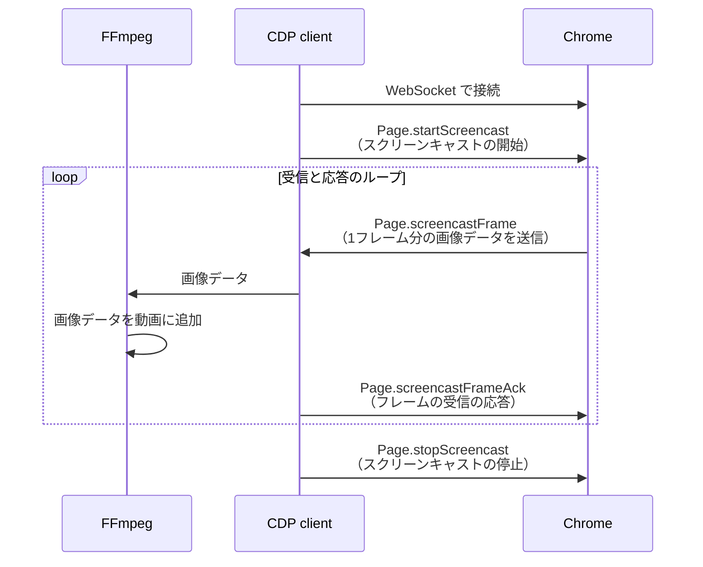

## はじめに

Node.js の E2E テストフレームワークである [Playwright](https://playwright.dev/) には[テストケースごとのブラウザ操作を録画する機能](https://playwright.dev/docs/videos#record-video)があります。この機能には [Chrome DevTools Protocol](https://chromedevtools.github.io/devtools-protocol/)（CDP）が活用されています。

同じく CDP を活用したツールとして、Ruby にはブラウザ操作ツール [Ferrum](https://github.com/rubycdp/ferrum) があるものの、現在（2024/05/07）はまだ録画機能が実装されていないようです。

そこで今回、Playwright のブラウザ録画機能に使われている技術を解説するとともに、Ruby で作成したブラウザ録画スクリプトを紹介します。

## 実際の録画例

作成した Ruby スクリプトで録画した動画です。

https://www.youtube.com/watch?v=X0il3Qy0VPA

## 使用している主な技術

### CDP を用いたスクリーンキャスト

CDP（Chrome DevTools Protocol）は、Chromium ベースのブラウザを操作するためのプロトコルです。今回は Chrome のみを動作確認しています。

CDP を使用して、Chrome の画面フレームを連続的にキャプチャし、クライアント（エンドポイント）へ送信しています。
以下がその手順です：

1. [Page.startScreencast](https://chromedevtools.github.io/devtools-protocol/tot/Page/#method-startScreencast): スクリーンキャストを開始し、フレームの連続キャプチャと送信を行います。設定可能なオプションとして、画像形式（jpeg または png）、画像品質（0..100）、最大画像サイズ、および送信するフレーム頻度（何枚おきに送信するか）があります。
2. [Page.screencastFrame](https://chromedevtools.github.io/devtools-protocol/tot/Page/#event-screencastFrame): Base64 でエンコードされたフレーム画像データ、フレーム取得日時などを保持するイベントです。発火するとクライアント（エンドポイント）に送信されます。
3. [Page.screencastFrameAck](https://chromedevtools.github.io/devtools-protocol/tot/Page/#method-screencastFrameAck): 受信側が「`Page.screencastFrame` イベントを正常に受け取った」という応答です。応答を受け取った後、Chrome は次の `Page.screencastFrame` イベントを発火します。スクリーンキャストが停止されるまで、2と3が繰り返されます。

スクリーンキャストを停止する際は、[Page.stopScreencast](https://chromedevtools.github.io/devtools-protocol/tot/Page/#method-stopScreencast) を実行します。

### FFmpeg を用いた画像から動画への変換

[FFmpeg](https://ffmpeg.org/) は、主に動画や音声の変換に使用されるソフトウェアです。

FFmpeg を使用して、連続するフレーム画像から1つの動画ファイルを作成します。具体的には、`-f image2pipe` オプションを使ってパイプ経由で連続する画像データを受け取り、それを動画ファイルに逐次的に追加します。

その他の細かなオプション、たとえば解像度やフレームレートなどは、[Playwright の設定](https://github.com/microsoft/playwright/blob/release-1.44/packages/playwright-core/src/server/chromium/videoRecorder.ts#L101)を参考にしています。

## シーケンス図

Chrome と CDP クライアント（CDP を介して Chrome と通信するクライアント）、FFmpeg のインタラクションを簡単にしてシーケンス図で表すと、次のようになります。



## 実装した Ruby スクリプト

### 実行環境

- Ruby 3.3.0
- gem の chrome_remote^[`chrome_remote` はすでにメンテナンスされておらず、README に「代わりに Ferrum を使うとよい」という記載があります。しかし今回は、Ferrum は `Page.startScreencast` のサポートがないこと、他に試した gem `websocket-client-simple` は画像データ送受信のタイムラグが発生してしまうことを踏まえて、`chrome_remote` を使うこととしました] 0.3.0
- FFmpeg 7.0
- Google Chrome 124.0.6367.79 (arm64)

Playwright の [`playwright-core/src/server/chromium/videoRecorder.ts`](https://github.com/microsoft/playwright/blob/release-1.44/packages/playwright-core/src/server/chromium/videoRecorder.ts) を参考にしつつ、次のように実装しました。

@[gist](https://gist.github.com/AudioStakes/50ed995cc2190b5facaadb92054e4507)

### 使い方

事前準備として、Google Chrome を `remote-debugging-port` を有効にした状態で起動しておく必要があります。
port 番号はデフォルトの 9222 です。
macOS の場合は以下のコマンドで起動できます。

```
$ /Applications/Google\ Chrome.app/Contents/MacOS/Google\ Chrome --remote-debugging-port=9222
```

Chrome を起動した後、スクリプトを実行します。

```
$ ruby chrome_screen_recorder.rb
Connecting to Chrome launched with --remote-debugging-port=9222 ... Connected.
Recording started. Press Ctrl+C to stop.
```

スクリプトの実行中は Chrome が録画され続けます。
Chrome を手動で操作する必要があります。自動ブラウザ操作ツールとは連携していません。

Ctrl+C を押すと録画が終了し、動画が WebM 形式でローカルに保存されます。WebM はブラウザで再生できます。

### 注意点

`Page.screencastFrame` イベントの処理がフレームレート（25 fps）を下回る場合、実際の録画時間より短い動画が生成されてしまいます。この問題を解決するため、次のように、遅延した場合は最後に受信したフレームを複数回書き込んでいます。

``` ruby
duration_sec = frame.timestamp - @last_frame.timestamp
repeat_count = [1, (duration_sec * FRAMES_PER_SECOND).to_i].max

repeat_count.times { @ffmpeg_io.write(@last_frame.data) }
```

これにより、出力する動画のフレームレートを維持しています。

## まとめ

Playwright のブラウザ録画機能に使われている技術を紹介し、Ruby による実装例を紹介しました。具体的には、CDP（Chrome DevTools Protocol）を活用して Chrome のスクリーンキャストを行い、連続する画像データを FFmpeg で動画ファイルに変換しました。

今後の展望として、Capybara 等の Ruby 製の E2E テストフレームワークにブラウザ録画機能を追加してみたいと考えています。

最後まで読んでいただき、ありがとうございました。

## 参考資料

- [Playwright のブラウザ録画機能のソースコード](https://github.com/microsoft/playwright/blob/release-1.44/packages/playwright-core/src/server/chromium/videoRecorder.ts)
- [ChromeRemote リポジトリ](https://github.com/cavalle/chrome_remote)
- [Chrome DevTools Protocol](https://chromedevtools.github.io/devtools-protocol/)
- [How to do video recording on headless chrome](https://medium.com/@anchen.li/how-to-do-video-recording-on-headless-chrome-966e10b1221)
