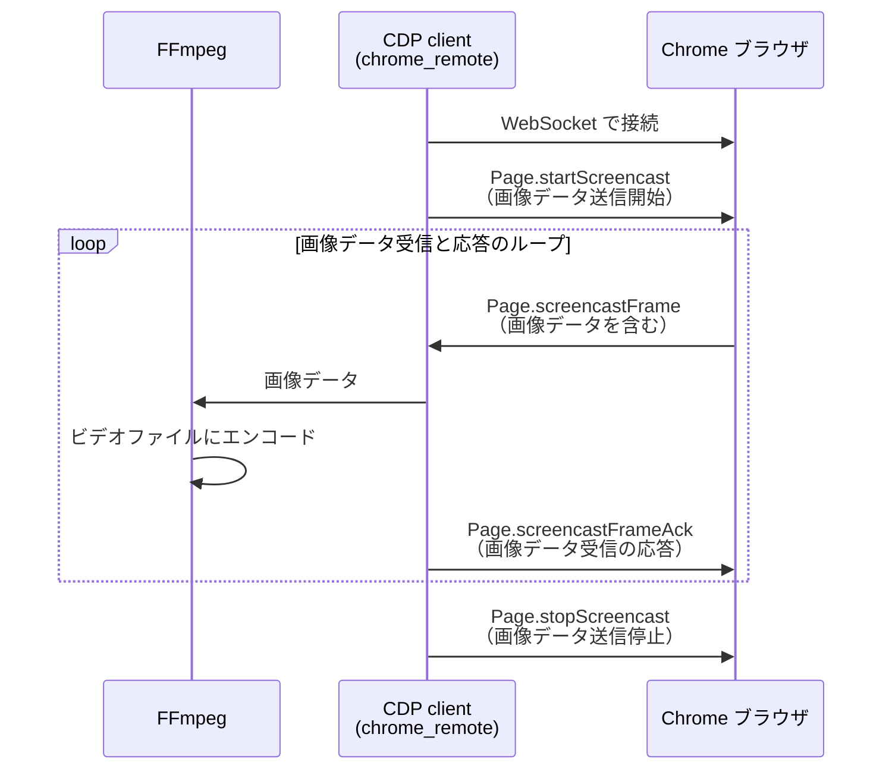

## はじめに

- Node.js の E2E テストフレームワーク Playwright にはブラウザ操作を録画する機能がある
- Playwright の録画機能には、Chrome 等のブラウザを操作するプロトコルである Chrome DevTools Protocol（CDP）が使われている
- Ruby で実装された CDP を使ったブラウザ操作ツールである Ferrum には、録画機能がない
- この記事では、Playwright を参考にして録画機能を Ruby で実装したので紹介する
- なお、Playwright では自動テストコードでブラウザを操作しますが、この記事では手動でブラウザを操作します。

## 実行環境

- Ruby
- chrome_remote
- FFmpeg

## 録画例

## 使用する主な技術

### CDP のクライアント

- gem の chrome_remote を使う
- chrome_remote はすでにメンテナンスされておらず、README に「代わりに Ferrum を使うとよい」という旨の文章があるものの、Ferrum は録画機能に使う Page.startScreencast メソッドをサポートしていないため、今回は chrome_remote を使うこととした
- 他の gem である websocket-client-simple も試したものの、画像データ送受信のタイムラグが発生し、解消できなかったため、chrome_remote を使うこととした

### CDP の Page.startScreencast メソッド

- Chrome の画面の画像データ送信を開始させるメソッド
- 画像データは Base 64 でエンコードされ、Page.screencastFrame イベントに保持させる形で連続的に送信される

### FFmpeg

- 動画と音声を変換できるソフトウェア
- 今回は、受信した画像データをビデオファイルにエンコードするために使用

それぞれのやり取りをシーケンス図で表すと、次のようになります。



## 実装したプログラム

### 使い方

事前準備として、Chrome ブラウザを remote-debugging-port を有効にした状態で起動しておく必要があります。
port 番号はデフォルトの 9222 です。
macOS の場合は以下のコマンドで起動できます。

```
/Applications/Google\ Chrome.app/Contents/MacOS/Google\ Chrome --remote-debugging-port=9222
```

次に、プロセスを起動します。

```
$ ruby chrome_screen_recorder.rb
Recording started. Press Ctrl+C to stop.
```

プロセス起動中は Chrome が録画され続けます。
Ctrl+C でプロセスを終了すると録画も終了します。

録画ファイルは WebM 形式、ブラウザで再生できます。

### FFmpeg コマンドのオプション

Playwright の FFmpeg コマンドのオプションをほぼそのまま使用しています。
FFmpeg をストリームモードで起動し、標準入力から受け取った画像データで動画を作成しています。

### 隙間を埋めている

Page.screencastFrame イベントの受信が frame rate より遅延していた場合、実際の撮影時間より短い動画になってしまうため、遅延した分は同じ画像データで埋めるようにしています。

## まとめ

を紹介しました。

## 参考資料
